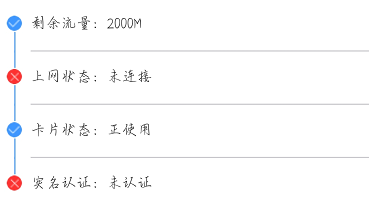

<!--
 * @Desc: ---   ----
 * @Date: 2019-11-11 15:09:19
 * @LastEditors: 王
 * @LastEditTime: 2019-11-12 10:52:44
 -->

# 常用方法

## 手机号正则验证

1. 本 demo 为 TS 使用,JS 使用将参数 `num:string` 删除。
2. 参数为单个参数,返回 true/false
3. 手机号段具有不稳定性，使用前请效验准确性。

```javascript
function RegPhone(num: string) {
  const Rge = new RegExp(/^(13[0-9]|15[^4]|18[0-9]|17[0-8]|147)\d{8,8}$/)
  return Rge.test(num)
}
```

## 微信公众号获取用户信息

### TypeScript 方法

1. [getQueryString](#正则解析-url-获取公众号-code) 获取公众号 code 方法

```typescript
/*
  @param { function } callback - 获取到openid后可执行的函数(可穿可不穿)
*/
async function GetOpenId(callback?: Function) {
  var redirecturl = encodeURIComponent(window.location.href)
  code = getQueryString('code')
  if (!code && !openid) {
    window.location.href =
      'http://open.weixin.qq.com/connect/oauth2/authorize?appid=' +
      wxappid +
      '&redirect_uri=' +
      redirecturl +
      '&response_type=code&scope=snsapi_base&state=0#wechat_redirect'
  } else if (code && !openid) {
    const openid: RootStateTypes = await GetQryWebToken()
    await GetUserinfo(openid.openid)
    if (callback) callback()
  } else {
    if (callback) callback()
  }
}
```

## 正则解析 URL 获取公众号 code

```typescript
/*
  @param { string } name - 获取到微信回调的url链接
*/

function getQueryString(name: string) {
  var reg = new RegExp('(^|&)' + name + '=([^&]*)(&|$)', 'i')
  var r = window.location.search.substr(1).match(reg)
  if (r != null) return unescape(r[2])
  return null
}
```

## 微信 JSSDK 授权

微信 jssdk 权限列表[查看全部](https://developers.weixin.qq.com/doc/offiaccount/OA_Web_Apps/JS-SDK.html)

```typescript
/**
 * desc 获取微信JSSDK签名
 * author wxw
 * time 2019年10月25日 11:40:39 星期五
 */
let appId: string = ''
let timestamp: number | null = null
let signature: string = ''
let nonceStr: string = ''
async function GetSignature(callback?: Function) {
  try {
    const res: WXauthorizeType = await GetWxSig()
    appId = res.appId
    timestamp = res.timestamp
    signature = res.signature
    nonceStr = res.nonceStr
  } catch (error) {
    console.log(error)
  }
  wx.config({
    beta: true,
    debug: false,
    appId, // 必填，公众号的唯一标识
    timestamp, // 必填，生成签名的时间戳
    nonceStr, // 必填，生成签名的随机串
    signature, // 必填，签名
    jsApiList: ['scanQRCode', 'translateVoice', 'chooseWXPay']
  })
  wx.ready(() => {
    wx.showAllNonBaseMenuItem()
    if (callback) {
      callback()
    }
  })
}
```

## 将 base64 转换为文件

```javascript
function dataURLtoFile(dataurl, filename) {
  var arr = dataurl.split(','),
    mime = arr[0].match(/:(.*?);/)[1],
    bstr = atob(arr[1]),
    n = bstr.length,
    u8arr = new Uint8Array(n)
  while (n--) {
    u8arr[n] = bstr.charCodeAt(n)
  }
  return new File([u8arr], filename, {
    type: mime
  })
}
```

## 原图转回 base64

```javascript
/*
   @return base64
*/
function img2file(src, can_w, can_h, callback) {
  var _caipu_img = new Image()

  _caipu_img.src = src

  _caipu_img.onload = function() {
    var canvas = document.createElement('canvas')
    var ctx = canvas.getContext('2d')
    canvas.width = can_w
    canvas.height = can_h
    var w = _caipu_img.width
    var h = _caipu_img.height

    ctx.drawImage(_caipu_img, 0, 0, w, h)

    //异步操作 不回调可能会取到undefined

    if (callback && typeof callback == 'function') {
      return callback(canvas.toDataURL('image/png', 1))
    }
  }
}
```

## 时间转换

```javascript
/**
 * 时间转换
 * @param {Number} time 时间
 * @param {String} cFormat 时间格式 默认 {y}/{m}/{d} {h}:{i}:{s}
 * @return {Sting} time_str 转换后的时间字符串
 * */
function parseTime(time,cFormat){
	if (arguments.length === 0) {
	  return null
	}
	const format = cFormat || '{y}/{m}/{d} {h}:{i}:{s}'
	let date
	if (typeof time === 'object') {
	  date = time
	} else {
	  if (('' + time).length === 10) time = parseInt(time) * 1000
	  date = new Date(time)
	}
	const formatObj = {
	  y: date.getFullYear(),
	  m: date.getMonth() + 1,
	  d: date.getDate(),
	  h: date.getHours(),
	  i: date.getMinutes(),
	  s: date.getSeconds(),
	  a: date.getDay()
	}
	const time_str = format.replace(/{(y|m|d|h|i|s|a)+}/g, (result, key) => {
	  let value = formatObj[key]
	  // Note: getDay() returns 0 on Sunday
	  if (key === 'a') { return ['日', '一', '二', '三', '四', '五', '六'][value ] }
	  if (result.length > 0 && value < 10) {
	    value = '0' + value
	  }
	  return value || 0
	})
	return time_str
}
```

## vue-element-admin后台 点击侧边栏 刷新当前路由

```javascript
/**
 * 解决方法：
 * 点击侧边栏菜单时，先跳转到Redirect 页面，在Redirect页面再将路由重定向到想去的页面，这样就起到了刷新的效果了。
 * Redirect页面和路由配置admin后台自带的有，只需修改 @/views/layout/components/Sidebar/Link.vue 文件 中的 linkProps 方法
 * 弊端：
 * 第一次点击菜单时也会触发重定向
 * */
linkProps(url) {
  if (this.isExternalLink(url)) {
    return {
      is: 'a',
      href: url,
      target: '_blank',
      rel: 'noopener'
    }
  }
  return {
    is: 'router-link',
    to: 'redirect' + url  // 在url前加上'redirect'即可
  }
}
```

## 常用正则校验

```javascript
/**
 * 邮箱
 * @param {*} s
 */
export function isEmail (s) {
  return /^([a-zA-Z0-9_-])+@([a-zA-Z0-9_-])+((.[a-zA-Z0-9_-]{2,3}){1,2})$/.test(s)
}

/**
 * 手机号码
 * @param {*} s
 */
export function isMobile (s) {
  return /^1[0-9]{10}$/.test(s)
}

/**
 * 电话号码
 * @param {*} s
 */
export function isPhone (s) {
  return /^([0-9]{3,4}-)?[0-9]{7,8}$/.test(s)
}

/**
 * URL地址
 * @param {*} s
 */
export function isURL (s) {
  return /^http[s]?:\/\/.*/.test(s)
}

/**
 * 8-16位数字和字母密码
 * @param {*} s
 */
export function isPassWord (s) {
  return /^(?![0-9]+$)(?![a-zA-Z]+$)[0-9A-Za-z]{8,16}$/.test(s)
}

/**
 * QQ号
 * @param {*} s
 */
export function isQQ (s) {
  return /[1-9][0-9]{4,}/.test(s)
}

/**
 * IP地址
 * @param {*} s
 */
export function isIP (s) {
  return /\d+\.\d+\.\d+\.\d+/.test(s)
}

/**
 * 中文
 * @param {*} s
 */
export function isZH (s) {
  return /^[\u4e00-\u9fa5]*$/.test(s)
}
```

## 计算倒计时

```javascript
/**
 * 倒计时
 * @param {Number} timeStamp 倒计时结束的时间戳 毫秒 13位
 */
export function seckillTime(timeStamp) {
  timeStamp = timeStamp - new Date().getTime()
  let day = Math.floor(timeStamp / (24 * 3600 * 1000))
  let leave1 = timeStamp % (24 * 3600 * 1000)
  let hours = Math.floor(leave1 / (3600 * 1000))
  let leave2 = leave1 % (3600 * 1000)
  let minutes = Math.floor(leave2 / (60 * 1000))
  let leave3 = leave2 % (60 * 1000)
  let seconds = Math.floor(leave3 / 1000)
  if (day) return day + '天' + hours + '小时' + minutes + '分'
  if (hours) return hours + '小时' + minutes + '分' + seconds + '秒'
  if (minutes) return minutes + '分' + seconds + '秒'
  if (seconds) return seconds + '秒'
  return '时间到！'
}
```

## 数据状态组件(uni-app)



组件名：uni-steps

组件下载地址  https://files.cnblogs.com/files/baobao0205/uni-steps.rar

使用方式
1、在 script 中引用组件

```javascript
import uniSteps from '@/components/uni-steps/uni-steps.vue'
export default {
    components: {uniSteps}
}
```
2、在 template 中的使用
```javascript
<uni-steps :options="options" :success-icon="successimg" :error-icon="errorimg"></uni-steps>
```
3、属性说明
     属性名       类型    	默认值                              说明
    options      Array                格式为：[{title:'xxx',state:'1'},{title:'xxx',state:'0'}] title: 显示内容  state: 状态 1成功 2失败
  successimg    String
   errorimg     String
   rowColor     String    #3D97FF
  borderColor   String    #c8c7cc


